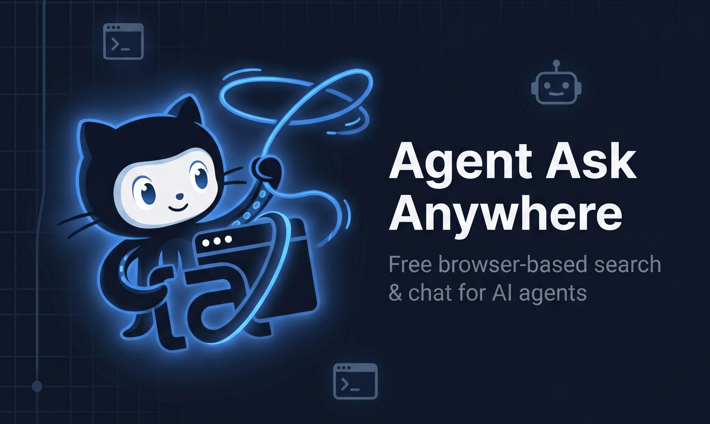

# agent-ask-anywhere

Grave fluxos no navegador clicando, deixe a extensão executar de novo no
piloto automático — e, quando a página mudar de jeito, o **Claude** entra em
cena para destravar. As skills ficam em arquivos versionáveis na sua
máquina (formato **Agent Skills** da Anthropic), então você pode editar,
versionar e compartilhar como qualquer outro repo.

> **Status:** v1.0 — POC funcional em todas as 7 fases do roadmap. Veja
> [`docs/TECHNICAL.md`](./docs/TECHNICAL.md) para o guia técnico completo
> e [`AGENTS.md`](./AGENTS.md) se você for um agente LLM trabalhando no
> repositório.

---

## Como começar

### Requisitos

- **Node.js 20+** (use o `.nvmrc`: `nvm use`)
- **pnpm 11+** (`corepack enable && corepack prepare pnpm@11.0.9 --activate`)
- **Chrome 116+** (precisa de `chrome.offscreen`)
- *(opcional)* **`ANTHROPIC_API_KEY`** — sem ela, gravação/replay funcionam,
  só o endpoint `/chat` (orchestrator LLM) responde 503.

### Instalação

```bash
git clone <este-repo> agent-ask-anywhere
cd agent-ask-anywhere
pnpm install
```

### Rodando

Abra **dois terminais**:

```bash
# terminal 1 — servidor (Fastify :7860 + WebSocket :8765)
export ANTHROPIC_API_KEY=sk-ant-...   # opcional
pnpm dev:server
```

```bash
# terminal 2 — extensão (WXT em modo dev)
pnpm dev:extension
```

Depois carregue a extensão no Chrome:

1. `chrome://extensions/` → ative **Developer mode**
2. **Load unpacked** → aponte para `packages/extension/.output/chrome-mv3/`
3. O ID da extensão é estável entre máquinas (chave RSA fixa em `.extension-key.txt`)

Quando o popup mostrar **"Connected to localhost:8765"**, está pronto.

---

## Usando

### 1. Gravar uma skill

1. Clique no ícone da extensão → **● Start recording**
2. Faça o fluxo na página: hovers mostram seletores em overlay, clicks são
   capturados (e neutralizados — não disparam navegação real durante a
   gravação), e o que você digita é gravado normalmente.
3. **■ Stop recording**

A skill é salva como pasta em `~/.local/agent-skills/draft-<timestamp>/`
contendo `SKILL.md` (frontmatter YAML + descrição em markdown) e `flow.json`
(passos do fluxo). Cada operação faz commit no git automaticamente.

Edite o `SKILL.md` para dar um nome decente, descrever o objetivo, e declarar
os **slots** (variáveis que o LLM vai preencher, tipo destinatário, valor,
data, etc.). O servidor recarrega em ≤200 ms.

### 2. Executar via LLM

```bash
curl -X POST http://127.0.0.1:7860/chat \
  -H "Content-Type: application/json" \
  -d '{"message": "responda João no Teams dizendo que estou atrasado"}'
```

O LLM lista as skills, escolhe a melhor, extrai os slots da sua mensagem, e
chama `run_skill`. Slots do tipo `secret` são resolvidos no servidor a partir
de `~/.config/agent-ask-anywhere/secrets.json` — **o LLM nunca vê o valor**.

### 3. Gerenciar skills

A página de **Options** (`chrome://extensions/` → ícone → **Options**) tem:

- lista filtrável de skills com busca por nome/descrição
- detalhes (slots, JSON do flow, runs recentes via JSONL)
- **Export** `.skill` (zip) e **Import** (upload) para compartilhar entre
  máquinas
- **Delete** (com commit no git)

---

## Resolução de problemas

| Problema | Causa provável | O que fazer |
|---|---|---|
| Popup mostra "Disconnected" | Servidor Node não está rodando | Verifique terminal 1 — `pnpm dev:server` |
| Botão "Start recording" desabilitado | WS não conectou | Confira se a porta `8765` está livre, recarregue a extensão |
| `/chat` retorna 503 | `ANTHROPIC_API_KEY` ausente | Exporte a chave **antes** de subir o servidor |
| "missing slot: foo" no replay | Slot não preenchido pelo LLM ou faltando no payload | Cheque `frontmatter.slots[].required` no `SKILL.md` |
| Banner amarelo "está debugando" | CDP foi anexado (esperado) | Ignore — só aparece quando o fallback CDP roda |
| Captcha bloqueando | Detecção heurística pausou o fluxo | Resolva manualmente, o replay retoma sozinho (timeout 5min) |

Para diagnóstico mais fundo, leia [`docs/TECHNICAL.md`](./docs/TECHNICAL.md).

---

## Comunidade — como ajudar

Esse projeto é um **POC público**. Toda contribuição é bem-vinda.

### Reportar bugs e pedir features

Abra uma issue contando:

- **Versão do Chrome** (`chrome://version`)
- **Plataforma** (Linux/macOS/Windows + arquitetura)
- **Logs**: terminal do `pnpm dev:server` + console da extensão
  (`chrome://extensions/` → background page → DevTools)
- **Site afetado** (se for um bug de replay): URL, e se possível um pequeno
  flow.json reproduzindo

### Compartilhar skills

Use **Options → Export** para gerar o `.skill` (zip) e abra um PR ou compartilhe
no canal de discussões. Padrão: pasta com `SKILL.md` + `flow.json` + assets
opcionais.

> ⚠️ **Antes de publicar uma skill:** confira se `flow.json` não tem URLs,
> emails, IDs internos ou dados de cliente. O recorder captura o que você
> digitou — substitua por `{{slots}}` antes de compartilhar.

### Contribuindo código

```bash
pnpm install
pnpm typecheck   # TypeScript estrito em todos os packages
pnpm lint        # Biome
pnpm test        # node:test em shared/server
pnpm build       # build de tudo
```

Para entender a arquitetura antes de tocar no código, leia
[`docs/TECHNICAL.md`](./docs/TECHNICAL.md). Se você é um agente LLM,
[`AGENTS.md`](./AGENTS.md) tem o resumo das regras invioláveis.

**Convenções rápidas:**

- TypeScript estrito (`noUncheckedIndexedAccess`, `verbatimModuleSyntax`)
- Imports relativos sempre com `.js` (mesmo apontando para `.ts`)
- Zod em **todas** as bordas (WS, REST, frontmatter, flow.json)
- Sem dependência nativa nova sem discussão (`keytar`, `node-pty` etc.)
- Commits no estilo Conventional Commits (`feat:`, `fix:`, `chore:` …)

### Roadmap aberto

Itens conhecidos como "ainda não, mas seria bacana":

- Step-through debugger UI (pause/resume/skip via WS)
- Provedor LLM alternativo (OpenAI, Gemini, modelos locais via Ollama)
- Integração com OS keychain (`keytar`) como alternativa ao
  `secrets.json`
- Compatibilidade com Firefox (já temos `pnpm dev:firefox`/`build:firefox`,
  mas falta validar `chrome.offscreen` equivalente)

Encontrou outra coisa? Abra uma issue marcando como `enhancement`.

---

## Licença

[MIT](./LICENSE) — use, modifique, redistribua. Apenas mantenha o aviso de
copyright.

## Agradecimentos

Construído sobre [WXT](https://wxt.dev),
[Anthropic SDK](https://github.com/anthropics/anthropic-sdk-typescript),
[Fastify](https://fastify.dev), [@medv/finder](https://github.com/antonmedv/finder)
e o conceito de **Agent Skills** da Anthropic.
